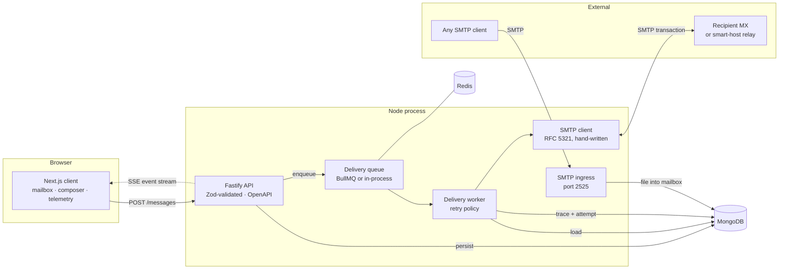

# Postal

**A self-hosted SMTP mail transfer agent that shows you where every millisecond went.**

Postal sends real mail over the wire — speaking RFC 5321 directly on sockets — and records the
duration of every phase of the transaction: the MX lookup, the TCP connect, the TLS handshake, the
server's greeting, and the payload transfer. It also *receives* mail: an inbound SMTP daemon accepts
messages from any standards-compliant client and files them into the addressed mailbox.

Most "mail" projects are a form that writes a database row. This one opens a socket.

```
C: EHLO mx.postal.local
S: 250-STARTTLS
S: 250 SIZE 26214400
C: STARTTLS
S: 220 2.0.0 Ready to start TLS
C: MAIL FROM:<you@postal.local> SIZE=1841
S: 250 2.1.0 Ok
C: RCPT TO:<peer@example.net>
S: 250 2.1.5 Ok
C: DATA
S: 354 End data with <CR><LF>.<CR><LF>
S: 250 2.0.0 Ok: queued as 4B2f1x
```

---

## Table of contents

- [What makes it interesting](#what-makes-it-interesting)
- [Architecture](#architecture)
- [Quick start](#quick-start)
- [Repository layout](#repository-layout)
- [Engineering decisions](#engineering-decisions)
- [API](#api)
- [Observability](#observability)
- [Testing](#testing)
- [Configuration](#configuration)
- [Limitations](#limitations)

---

## What makes it interesting

**A hand-written SMTP client.** The outbound protocol implementation is ours, built on `net`/`tls`
sockets rather than delegating to a mail library. That is the point: off-the-shelf clients report one
end-to-end duration, and the entire premise of this project is that "slow" is not a diagnosis. Owning
the socket makes every command boundary observable. It handles multi-line reply parsing, ESMTP
capability negotiation with a HELO fallback, opportunistic and enforced STARTTLS, `AUTH PLAIN`/`LOGIN`,
`SIZE` pre-checks, per-recipient acceptance, and RFC 5321 §4.5.2 dot-stuffing.

**A real SMTP server.** An inbound listener that accepts mail, parses MIME, and delivers it into local
mailboxes — refusing to relay for domains it is not authoritative for. The full loop closes: compose in
the browser, deliver over the wire with our own client, receive on the daemon, read it in the inbox.

**MTA retry semantics, not HTTP retry semantics.** The queue reads SMTP reply codes the way a mail
server must. A 5xx is the domain's final answer and bounces immediately; a 4xx is transient and defers
with exponential backoff and full jitter. Retrying a permanent rejection burns attempts on a guaranteed
failure; bouncing a transient one silently discards deliverable mail. Both mistakes are invisible until
they matter.

**Telemetry that answers a question.** Every transaction is stored as a phase-by-phase trace and
rendered as a waterfall. A wide TLS band and a wide DATA band mean completely different things — a
certificate negotiation problem versus a bandwidth problem — and in a single aggregate number they are
indistinguishable. The composer also sends the browser's own timings, so a send shows both halves of
the path: the user's link to the server, and the server's link to the recipient's MX.

---

## Architecture



**Request lifecycle for an outbound message**

1. `POST /api/v1/messages` validates against a Zod schema shared with the client.
2. The message is **persisted, then queued**, and the API answers `202 Accepted`. The ordering is what
   makes acceptance meaningful — the response promises the message will be delivered or bounced, not
   that it already has been.
3. A worker picks it up, resolves the recipient domain's MX records (or targets the configured smart
   host), and opens an SMTP session.
4. Each phase is timed. On `250`, the trace is written to the message. On `4xx`, a retry is scheduled
   with jittered backoff. On `5xx`, the message fails immediately.
5. The outcome is published to the SSE stream, and the dashboards update without a reload.

---

## Quick start

### With Docker (everything, one command)

```bash
cp .env.example .env          # optional — compose has working defaults
docker compose up -d          # API + MTA, MongoDB, Redis, Mailpit
npm install && npm run seed   # demo accounts and sample traces
npm run dev:web               # http://localhost:3000
```

| Service | URL | Purpose |
| --- | --- | --- |
| Web client | http://localhost:3000 | Mailbox, composer, telemetry |
| API docs | http://localhost:4000/docs | Interactive OpenAPI reference |
| Mailpit | http://localhost:8025 | Read the mail that was actually delivered |
| Metrics | http://localhost:4000/metrics | Prometheus exposition |
| SMTP ingress | `localhost:2525` | Send mail *into* Postal |

Mailpit is what makes the project demonstrable offline: outbound mail is relayed to it over real SMTP
and is readable in its web UI, so the complete send-and-inspect loop runs with no internet connection
and no risk of delivering test mail to a real address.

Seeded accounts use the password `PostalDemo123!`.

### Without Docker

You need MongoDB on `localhost:27017`. Redis is optional — without `REDIS_URL` the queue falls back to
an in-process driver that works but does not survive a restart.

```bash
cp .env.example .env          # set MONGODB_URI and JWT_SECRET
npm install
npm run dev:server            # API on :4000, SMTP ingress on :2525
npm run dev:web               # web client on :3000
```

### Send mail into it from a real client

```bash
swaks --server localhost:2525 --to demo@postal.local --from you@example.net \
      --header "Subject: Hello from swaks"
```

It appears in the demo account's inbox.

---

## Repository layout

An npm workspaces monorepo. The shared package is what keeps the two apps honest: both validate
against the same Zod schemas, so the API contract cannot drift from what the client expects.

```
.
├── apps/
│   ├── server/                    # Fastify API + SMTP MTA (TypeScript)
│   │   ├── src/
│   │   │   ├── config/            # Zod-validated env, structured logging
│   │   │   ├── db/                # Connection, seed
│   │   │   ├── models/            # Mongoose schemas and indexes
│   │   │   ├── modules/           # auth · messages · stats · health · events
│   │   │   ├── smtp/              # ★ client · ingress · resolver · transcript
│   │   │   ├── queue/             # Drivers, delivery worker, retry policy
│   │   │   ├── plugins/           # Security, auth guard, error handler, OpenAPI
│   │   │   └── lib/               # Errors, metrics, event bus, pagination
│   │   └── tests/                 # Unit + full-system integration
│   └── web/                       # Next.js client (Pages Router, MUI)
│       ├── components/            # SmtpWaterfall, dashboard, composer
│       ├── lib/                   # API client, auth context, client-side tracing
│       └── pages/
└── packages/
    └── shared/                    # Zod contracts + types used by both
```

Each module is a vertical slice — routes, service, and mapper together — rather than horizontal
`controllers/`, `services/`, `models/` folders. Changing how messages work touches one directory.

---

## Engineering decisions

Decisions worth defending, and why.

<details>
<summary><b>Why write the SMTP client instead of using Nodemailer?</b></summary>

Nodemailer is used — for MIME composition, which is genuinely intricate (header folding, encoding
selection, multipart boundaries) and where a subtle bug produces mail that renders as garbage in some
clients and fine in others. That is a solved problem worth delegating.

The wire protocol is not delegated, because the project's entire value is knowing which phase was slow.
A library that reports one duration cannot answer that. Writing the client means the TCP connect, the
TLS handshake, the greeting latency and the DATA upload are separately timed and separately graphed.

It also surfaces the details that only appear when you own the socket: multi-line reply continuations,
re-issuing EHLO after a STARTTLS upgrade because the handshake resets the session, and dot-stuffing —
without which a message containing a line of `.` alone is silently truncated at that point.
</details>

<details>
<summary><b>Why is the delivery queue's retry policy not BullMQ's?</b></summary>

BullMQ has `attempts` and `backoff` built in, and they are the wrong tool here. Retry decisions in SMTP
depend on the reply code, which BullMQ cannot see — it only knows the job threw. Letting it retry
blindly would keep hammering a permanent `550` rejection until attempts ran out, and would treat a
`421` the same as a malformed address.

So the worker owns the policy: classify the failure, then either schedule the next attempt or stop.
BullMQ provides durability and scheduling; the mail semantics stay in the mail code.
</details>

<details>
<summary><b>Why keyset pagination rather than offsets?</b></summary>

A mailbox is a live list. With `skip`/`limit`, mail arriving between page one and page two shifts every
row down, and the user sees an item twice while another is never shown. Anchoring each page to the
`(createdAt, _id)` of the last item makes page two "everything older than this", which stays correct
under concurrent inserts. The composite key breaks ties between messages created in the same
millisecond, and the compound index `{owner, folder, createdAt}` satisfies the filter and the ordering
in one scan.
</details>

<details>
<summary><b>Why refresh-token rotation with reuse detection?</b></summary>

Access tokens are short-lived JWTs held in memory — never in `localStorage`, where any injected script
can read them. Session continuity comes from an httpOnly refresh cookie, unreadable by JavaScript
entirely, scoped to `/api/v1/auth` so no other endpoint receives it.

Refresh tokens are opaque random strings checked against the database on every use, not self-contained
JWTs — that is what makes immediate revocation possible. Each use rotates the token. If a token that
has *already* been exchanged is presented again, the legitimate client would be holding its successor,
so the replay means it leaked: the whole rotation family is revoked, logging out attacker and victim
together and forcing a fresh authentication.

Tokens are stored as SHA-256 digests rather than in the clear, so a dump of the collection is not a set
of live sessions. SHA-256 rather than Argon2 for these specifically: they are 384 bits of CSPRNG
output, so there is no low-entropy secret to slow a brute force against, and a fast digest keeps the
lookup indexable. Passwords, which *are* low-entropy, use Argon2id at OWASP's recommended parameters.
</details>

<details>
<summary><b>Why does a wrong password cost the same as an unknown account?</b></summary>

Because otherwise the login form is an account enumeration oracle. A request for an address that does
not exist would return in a fraction of the time one for a real address takes, since no hash gets
verified — and response time alone reveals which of your users have accounts here. The service hashes a
dummy digest on the miss path so both cost the same, and both return an identical message.
</details>

<details>
<summary><b>Why SSE rather than WebSockets?</b></summary>

The traffic is entirely server-to-client. SSE gets automatic reconnection, plain HTTP semantics, and no
second protocol to proxy or secure. A WebSocket would only pay off if the browser needed to push, and
it does not.
</details>

<details>
<summary><b>Why is the whole thing one process?</b></summary>

The API, the SMTP daemon and the delivery worker are co-located so that a single `npm start` brings up
a complete, working mail server — which matters a great deal for a project meant to be cloned and run
by someone who has five minutes.

Each subsystem is independently startable, and the queue is already a network-backed boundary. Moving
the worker onto its own node is a deployment change, not a rewrite.
</details>

<details>
<summary><b>Where the durability boundary actually is</b></summary>

The in-process queue driver is explicitly not durable, and the README should not pretend otherwise: a
restart loses whatever was in flight. What bounds the damage is that the queue is a *scheduling cache*,
not the source of truth. Every deferred message is persisted with a `nextRetryAt`, and a sweeper
re-enqueues anything past due — at boot and periodically. So the durability gap is one sweep interval
rather than unbounded, and setting `REDIS_URL` closes it entirely.
</details>

---

## API

Full interactive reference at **`/docs`**, generated from the same Zod schemas that validate requests
at runtime — so the documentation cannot disagree with the behaviour.

| Method | Endpoint | Purpose |
| --- | --- | --- |
| `POST` | `/api/v1/auth/register` | Create an account and open a session |
| `POST` | `/api/v1/auth/login` | Exchange credentials for an access token |
| `POST` | `/api/v1/auth/refresh` | Rotate the refresh cookie |
| `POST` | `/api/v1/auth/logout` | Revoke the session family |
| `GET` | `/api/v1/auth/me` | The authenticated account |
| `POST` | `/api/v1/messages` | Submit a message for delivery → `202` |
| `GET` | `/api/v1/messages` | List a folder, keyset-paginated, full-text searchable |
| `GET` | `/api/v1/messages/:id` | One message with body, attempts and traces |
| `PATCH` | `/api/v1/messages/:id` | Update read / starred / folder |
| `POST` | `/api/v1/messages/:id/retry` | Re-queue a failed or deferred message |
| `DELETE` | `/api/v1/messages/:id` | Delete a message |
| `GET` | `/api/v1/stats/summary` | Delivery rate, latency percentiles, phase breakdown |
| `GET` | `/api/v1/events/stream` | Live delivery events (SSE) |
| `GET` | `/healthz` · `/readyz` | Liveness and readiness probes |
| `GET` | `/metrics` | Prometheus exposition |

**Example — submit and inspect**

```bash
TOKEN=$(curl -s -X POST localhost:4000/api/v1/auth/login \
  -H 'content-type: application/json' \
  -d '{"email":"demo@postal.local","password":"PostalDemo123!"}' | jq -r .accessToken)

ID=$(curl -s -X POST localhost:4000/api/v1/messages \
  -H "authorization: Bearer $TOKEN" -H 'content-type: application/json' \
  -d '{"to":["peer@example.net"],"subject":"Hello","body":"Over the wire."}' | jq -r .id)

curl -s "localhost:4000/api/v1/messages/$ID" -H "authorization: Bearer $TOKEN" \
  | jq '.attempts[-1].trace.phases'
```

```json
[
  { "phase": "tcp",      "durationMs": 0.418 },
  { "phase": "greeting", "durationMs": 109.254 },
  { "phase": "ehlo",     "durationMs": 1.239 },
  { "phase": "mailFrom", "durationMs": 0.857 },
  { "phase": "rcptTo",   "durationMs": 0.467 },
  { "phase": "data",     "durationMs": 1.685 },
  { "phase": "quit",     "durationMs": 0.232 }
]
```

That trace is from a real send. Note that 109 ms of a 119 ms transaction was spent waiting for the
server's banner — the classic signature of a greylisting or tarpitting peer, and completely invisible
in an end-to-end number.

---

## Observability

- **Metrics** — Prometheus histograms for SMTP transaction duration and per-phase duration (bucketed
  for SMTP, not HTTP: a same-datacentre relay settles in single-digit milliseconds while a cold remote
  connection with a TLS handshake lands in the hundreds), counters for accepted/delivered/bounced mail
  and observed reply codes by class, and gauges for queue depth and connected dashboard clients.
- **Health** — `/healthz` never touches a dependency, so a liveness probe cannot be failed by a slow
  database. `/readyz` reports component status and returns `503` only when MongoDB is unreachable; a
  degraded queue reports `degraded` but still serves mailboxes.
- **Logging** — structured JSON via Pino with request-id correlation. Credentials, tokens and message
  bodies are redacted at the logger rather than at each call site, so a careless `log.info({ body })`
  cannot leak them.
- **Transcripts** — every SMTP conversation is recorded with `AUTH` payloads stripped at the only place
  that sees them.

---

## Testing

```bash
npm test          # 55 tests
npm run typecheck
npm run lint
```

Tests run against a **real MongoDB** started in-process (`mongodb-memory-server`) and a **real SMTP
server** as the delivery peer. Aggregation pipelines, unique indexes and protocol behaviour are exactly
the parts most likely to be wrong, and a mock would assert nothing about them.

`tests/integration.test.ts` exercises the whole system with nothing stubbed — API → queue → worker →
our SMTP client → a real peer, plus the inbound daemon — and asserts:

- a message travels from `POST /messages` to a real SMTP peer and its trace is recorded
- a `4xx` reply defers and schedules a retry; a `5xx` fails immediately without one
- client-side timings survive the round trip into the stored trace
- the analytics summary computes real percentiles from real transactions
- inbound mail for a local mailbox is accepted and filed
- **mail for a foreign domain is refused** — the open-relay check
- mail for an unknown local address is refused

---

## Configuration

Every variable is declared and validated in `apps/server/src/config/env.ts`. Nothing else reads
`process.env`, and a missing or malformed value fails at boot with a readable report rather than
surfacing as `undefined` inside a request handler. See `.env.example` for the full annotated set.

The variables worth knowing:

| Variable | Default | Notes |
| --- | --- | --- |
| `MONGODB_URI` | — | Required |
| `JWT_SECRET` | — | Required, ≥ 32 characters |
| `REDIS_URL` | unset | Unset ⇒ in-process queue (not durable) |
| `MAIL_DOMAIN` | `postal.local` | The domain this MTA is authoritative for |
| `SMTP_RELAY_HOST` | unset | Set ⇒ smart host; unset ⇒ direct-to-MX |
| `SMTP_TLS_POLICY` | `opportunistic` | `disabled` · `opportunistic` · `require` |
| `DELIVERY_MAX_ATTEMPTS` | `5` | Before a deferred message is bounced |

---

## Limitations

Stated plainly, because a project that claims to be a complete mail server and is not would be worse
than one that says where it stops.

- **No DKIM, SPF or DMARC.** Outbound mail is unsigned and inbound mail is not authenticated. Real
  delivery to major providers requires all three; this server would be filed as spam.
- **No TLS on the inbound listener.** STARTTLS is advertised only when a certificate is configured,
  which it is not by default — announcing it without one produces handshake failures that clients
  report as an outage.
- **Direct-to-MX handles one recipient domain per message.** A multi-domain message is rejected with an
  explanation rather than silently delivered to one of them. Configuring a smart host removes the
  restriction.
- **Attachments are stored inline in MongoDB.** A deliberate scope choice given the 25 MB ceiling; a
  deployment expecting large mail would use an object store and stream the body.
- **Single-instance event bus.** The SSE stream is fed by an in-process emitter. Running more than one
  API instance would need a Redis pub/sub channel behind the same two functions.
- Two `npm audit` advisories remain, both in the `postcss` version bundled by Next.js 15 and only
  fixable by a major upgrade to Next 16.

---

## Licence

MIT
